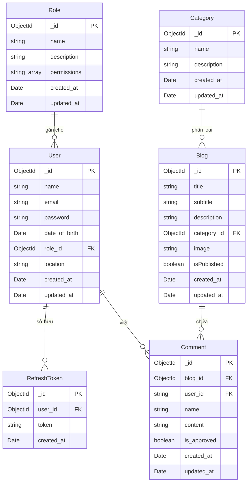
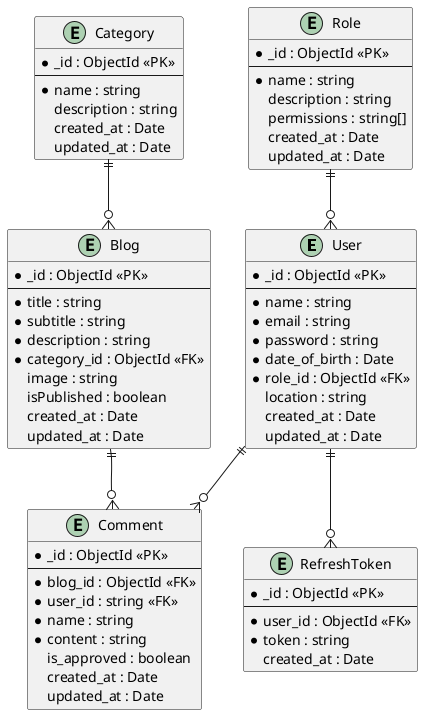

# AI-Powered Blog Web

Đây là đồ án môn học **Lập trình Web** của sinh viên **Học viện Công nghệ Bưu chính Viễn thông (PTIT)**. Dự án xây dựng một hệ thống Blog hiện đại tích hợp trí tuệ nhân tạo (AI) để hỗ trợ sinh nội dung tự động, đi kèm với cơ chế phân quyền (RBAC - Role-Based Access Control) chặt chẽ cho ban quản trị.

---

## 🌟 Tính năng chính

### 1. Phân hệ Người dùng (Client - Frontend)
*   **Trang chủ (Home):** Hiển thị danh sách các bài viết mới nhất, được phân loại theo danh mục, hỗ trợ tìm kiếm và lọc.
*   **Chi tiết bài viết (Blog Detail):** Xem nội dung chi tiết bài viết dưới dạng rich text, danh sách bình luận.
*   **Bình luận (Comments):** Người dùng đã đăng nhập có thể gửi bình luận dưới các bài viết.
*   **Quản lý tài khoản (Profile):** Cập nhật thông tin cá nhân (Họ tên, ngày sinh, địa điểm,...).
*   **Đăng nhập & Đăng ký:** Hệ thống xác thực bằng JWT (Access Token & Refresh Token) an toàn.

### 2. Phân hệ Quản trị (Admin Dashboard)
*   **Quản lý bài viết (Blogs):**
    *   Xem danh sách, tìm kiếm, lọc theo trạng thái hiển thị và sắp xếp các bài viết.
    *   Thêm bài viết mới với ảnh thumbnail (Multer tải lên máy chủ) và nội dung soạn thảo bằng Quill Editor.
    *   **Tích hợp AI:** Hỗ trợ tính năng sinh tự động nội dung bài viết từ ý tưởng/chủ đề (Prompt) nhập vào.
    *   Duyệt bài viết (Ẩn/Hiện trên trang client).
*   **Quản lý danh mục (Categories):** Thêm, sửa, xóa các thể loại bài viết (Startup, Technology, Life, v.v.).
*   **Quản lý bình luận (Comments):** Kiểm duyệt bình luận, xóa các bình luận không phù hợp.
*   **Quản lý người dùng (Users):** Xem danh sách người dùng, cập nhật thông tin hoặc xóa tài khoản.
*   **Quản lý nhân sự (Staffs/Admins):** Admin cấp cao (Super Admin) có quyền tạo tài khoản admin mới, reset mật khẩu hoặc xóa tài khoản quản trị viên cấp dưới.
*   **Phân quyền chi tiết (Permissions/RBAC):** Gán quyền hạn cụ thể cho từng vai trò quản trị (Ví dụ: Quyền chỉ xem bài viết, quyền viết bài, quyền duyệt comment, v.v.).

---

## 🛠️ Công nghệ sử dụng

### 1. Frontend (`/client`)
*   **Core:** React 19, Vite (HMR)
*   **Styling:** Tailwind CSS v4 (Sử dụng `@tailwindcss/vite` để biên dịch trực tiếp)
*   **Routing:** React Router DOM v7
*   **Animations:** Motion (Framer Motion v12) cho các hiệu ứng chuyển trang, hover mượt mà
*   **Editor:** Quill Editor (Soạn thảo văn bản phong phú)
*   **Khác:** Moment.js (Định dạng thời gian), Lucide React (Bộ icon thiết kế hiện đại)

### 2. Backend (`/server`)
*   **Ngôn ngữ & Runtime:** TypeScript, Node.js (CommonJS module với trình biên dịch TS)
*   **Framework:** Express.js v5
*   **Cơ sở dữ liệu:** MongoDB (Sử dụng thư viện MongoDB Native Driver gốc thay vì Mongoose để tối ưu hiệu năng và kiểm soát câu lệnh tốt hơn)
*   **Bảo mật & Xác thực:** JWT (JSON Web Tokens), `bcrypt` (mã hóa mật khẩu)
*   **Upload File:** Multer (quản lý upload ảnh bài viết lưu trữ trên server local)
*   **Validation:** `express-validator` (kiểm tra và xác thực dữ liệu đầu vào từ API)
*   **Dev tools:** `nodemon`, `tsx`, `eslint`, `prettier`

---

## 📂 Cấu trúc thư mục dự án

```text
AI-powered-Blog-web/
├── client/                     # Mã nguồn Frontend (React)
│   ├── src/
│   │   ├── assets/             # Hình ảnh, tài nguyên tĩnh
│   │   ├── components/         # Các Component dùng chung (ProtectedRoute, DataTable,...)
│   │   ├── constants/          # Khai báo hằng số, RBAC config (rbac.jsx)
│   │   ├── context/            # React Context (AuthContext,...)
│   │   ├── pages/              # Các trang giao diện (Home, Blog, Admin,...)
│   │   ├── services/           # Gọi API backend (auth.api.js, blog.api.js)
│   │   └── utils/              # Các hàm bổ trợ
│   ├── package.json
│   └── vite.config.js
│
├── server/                     # Mã nguồn Backend (Express + TS)
│   ├── src/
│   │   ├── constants/          # Status codes, thông báo lỗi, enum định nghĩa quyền
│   │   ├── controllers/        # Điều hướng logic API (Blogs, Auth, Users, Admin,...)
│   │   ├── middlewares/        # Bộ lọc xác thực JWT, validate dữ liệu, xử lý lỗi
│   │   ├── models/             # Schema định nghĩa cấu trúc dữ liệu MongoDB & Interface
│   │   ├── routes/             # Cấu hình các API routes
│   │   ├── services/           # Truy vấn database MongoDB
│   │   ├── utils/              # Helper functions (xử lý lỗi, gọi mock AI)
│   │   └── index.ts            # Entrypoint của Backend
│   ├── tsconfig.json
│   └── .env                    # Biến môi trường kết nối Database và JWT
│
└── README.md                   # Tài liệu hướng dẫn dự án
```

---

## ⚙️ Hướng dẫn cài đặt và chạy ứng dụng

### 1. Chuẩn bị môi trường
Yêu cầu máy tính cài đặt sẵn:
*   [Node.js](https://nodejs.org/) (Khuyến nghị phiên bản LTS từ 18 trở lên)
*   Cơ sở dữ liệu [MongoDB Atlas](https://www.mongodb.com/cloud/atlas) hoặc MongoDB cài cục bộ (Local).

---

### 2. Cài đặt Backend (`/server`)

1.  Di chuyển vào thư mục server:
    ```bash
    cd server
    ```
2.  Cài đặt các gói phụ thuộc (dependencies):
    ```bash
    npm install
    ```
3.  Cấu hình file biến môi trường `.env`:
    *   Tạo file `.env` nằm trong thư mục gốc của `/server`.
    *   Nội dung cấu hình mẫu (có sẵn cấu hình database Atlas demo):
        ```env
        DB_USERNAME="kpcuongz_db_user"
        DB_PASSWORD="khongpcz"
        DB_NAME="Blog-web"
        DB_USERS_COLLECTION="users"
        DB_ROLES_COLLECTION="roles"
        DB_REFRESH_TOKENS_COLLECTION="refresh_tokens"
        DB_BLOGS_COLLECTION="blogs"
        DB_CATEGORIES_COLLECTION="categories"
        DB_COMMENTS_COLLECTION="comments"
        PASSWORD_SALT="khongpcz"
        JWT_SECRET="khongpcz"
        ACCESS_TOKEN_EXPIRES_IN="15m"
        REFRESH_TOKEN_EXPIRES_IN="100d"
        PORT=3000
        ```
4.  Chạy Backend ở chế độ phát triển (Development):
    ```bash
    npm run dev
    ```
    *   Server sẽ lắng nghe tại cổng `http://localhost:3000`.

---

### 3. Cài đặt Frontend (`/client`)

1.  Mở terminal mới và di chuyển vào thư mục client:
    ```bash
    cd client
    ```
2.  Cài đặt các gói phụ thuộc:
    ```bash
    npm install
    ```
3.  Chạy Frontend ở chế độ phát triển:
    ```bash
    npm run dev
    ```
    *   Ứng dụng React sẽ chạy tại địa chỉ mặc định `http://localhost:5173`.

---

## 🤖 Tích hợp Trí tuệ nhân tạo (AI Features)

Hiện tại, logic sinh nội dung tự động bằng AI tại `server/src/utils/ai.utils.ts` đang được mô phỏng dưới dạng trả về dữ liệu mẫu (Mock data):

```typescript
export const generateBlogContentAI = async (prompt: string): Promise<string> => {
  return `Đây là nội dung được tự động tạo bởi AI dựa trên prompt: "${prompt}".`
}
```

### Cách kết nối Google Gemini API thật:
Để kết nối với API thực tế của Google Gemini, bạn có thể thực hiện theo các bước sau:

1.  Cài đặt thư viện chính thức từ Google:
    ```bash
    npm install @google/generative-ai
    ```
2.  Đăng ký API Key tại [Google AI Studio](https://aistudio.google.com/) và lưu vào file `.env` của server:
    ```env
    GEMINI_API_KEY="KEY_CỦA_BẠN_Ở_ĐÂY"
    ```
3.  Cập nhật file `server/src/utils/ai.utils.ts` như sau:
    ```typescript
    import { GoogleGenAI } from '@google/generative-ai'

    export const generateBlogContentAI = async (prompt: string): Promise<string> => {
      const apiKey = process.env.GEMINI_API_KEY
      if (!apiKey) {
        throw new Error("Chưa cấu hình GEMINI_API_KEY trong file .env")
      }
      
      const genAI = new GoogleGenAI({ apiKey })
      const model = genAI.getGenerativeModel({ model: 'gemini-1.5-flash' })
      
      const systemInstruction = "Bạn là một nhà báo viết blog chuyên nghiệp. Hãy viết một bài viết chi tiết, cuốn hút dựa trên chủ đề được cung cấp bằng tiếng Việt, định dạng HTML để hiển thị tốt trên trang web."
      
      const result = await model.generateContent({
        contents: [{ role: 'user', parts: [{ text: prompt }] }],
        generationConfig: {
          temperature: 0.7,
        }
      })
      
      return result.response.text()
    }
    ```

---

## 🏷️ Hệ thống API Endpoints (Tóm tắt)

### 🔒 Đăng nhập / Đăng ký (`/api/auth`)
*   `POST /api/auth/register` - Đăng ký tài khoản mới.
*   `POST /api/auth/login` - Đăng nhập (trả về access token và refresh token).
*   `POST /api/auth/logout` - Đăng xuất tài khoản.
*   `POST /api/auth/refresh-token` - Gia hạn access token mới.

### 📝 Bài viết công khai (`/api/blogs`)
*   `GET /api/blogs` - Xem danh sách bài viết (hỗ trợ phân trang, tìm kiếm, lọc theo danh mục).
*   `GET /api/blogs/:id` - Xem chi tiết một bài viết.
*   `GET /api/blogs/categories` - Lấy toàn bộ danh mục bài viết.
*   `GET /api/blogs/:id/comments` - Xem bình luận của bài viết.
*   `POST /api/blogs/:id/comments` - Đăng bình luận mới (cần đăng nhập).

### 👑 Quản trị viên (`/api/admin`)
*(Yêu cầu xác thực Access Token & Quyền tương ứng)*
*   `GET /api/admin/blogs` - Danh sách toàn bộ bài viết dành cho admin.
*   `POST /api/admin/blogs` - Tạo bài viết mới kèm upload hình ảnh thumbnail.
*   `PATCH /api/admin/blogs/:id` - Cập nhật nội dung và hình ảnh bài viết.
*   `PATCH /api/admin/blogs/:id/status` - Ẩn/hiển thị bài viết công khai.
*   `POST /api/admin/blogs/generate` - Gọi AI sinh nội dung bài viết từ prompt.
*   `GET/POST/PATCH/DELETE /api/admin/categories` - Quản lý chuyên mục.
*   `GET/PATCH/DELETE /api/admin/comments` - Kiểm duyệt và xóa bình luận.
*   `GET/POST/PATCH/DELETE /api/admin/staffs` - Quản trị viên cấp cao quản lý danh sách Admin cấp dưới.

---

## 📊 Sơ đồ thực thể liên kết (ERD)

Dưới đây là mã nguồn để vẽ sơ đồ ERD dựa trên cấu trúc các Schemas trong thư mục `server/src/models/schemas`. Bạn có thể hiển thị sơ đồ này trực tiếp bằng các công cụ sau:

### 1. Sử dụng Mermaid (Khuyên dùng - Hiển thị trực tiếp trên GitHub/VS Code)
Sao chép đoạn mã dưới đây dán vào file markdown hoặc sử dụng trình xem Mermaid trực tuyến:



### 2. Sử dụng DBML (Vẽ sơ đồ tương tác trên [dbdiagram.io](https://dbdiagram.io))
Sao chép đoạn mã dưới đây và dán vào cửa sổ soạn thảo của **dbdiagram.io** để có sơ đồ trực quan và chuyên nghiệp:

```dbml
Table users {
  _id ObjectId [pk]
  name string
  email string
  password string
  date_of_birth Date
  role_id ObjectId [ref: > roles._id]
  location string
  created_at Date
  updated_at Date
}

Table roles {
  _id ObjectId [pk]
  name string
  description string
  permissions "string[]"
  created_at Date
  updated_at Date
}

Table blogs {
  _id ObjectId [pk]
  title string
  subtitle string
  description string
  category_id ObjectId [ref: > categories._id]
  image string
  isPublished boolean
  created_at Date
  updated_at Date
}

Table categories {
  _id ObjectId [pk]
  name string
  description string
  created_at Date
  updated_at Date
}

Table comments {
  _id ObjectId [pk]
  blog_id ObjectId [ref: > blogs._id]
  user_id string [ref: > users._id]
  name string
  content string
  is_approved boolean
  created_at Date
  updated_at Date
}

Table refresh_tokens {
  _id ObjectId [pk]
  user_id ObjectId [ref: > users._id]
  token string
  created_at Date
}
```

### 3. Sử dụng PlantUML
Dành cho các bạn quen thuộc với PlantUML:



---
Chúc các bạn hoàn thành xuất sắc đồ án môn học! 🎓

